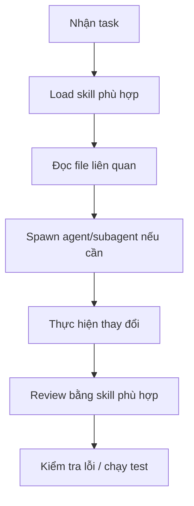

# ShipFood AI Rules

> ⚠️ **BẮT BUỘC**: Luôn sử dụng các skill đã cài đặt trong `.agents/skills/` trước khi thực hiện bất kỳ tác vụ nào.

---

## 1. 🎯 Nguyên tắc sử dụng Skills

**TRƯỚC KHI LÀM VIỆC**, phải kiểm tra và sử dụng skill phù hợp từ `.agents/skills/`:

```yaml
quy_tắc_bắt_buộc:
  - Luôn load skill phù hợp với task trước khi bắt đầu
  - Dùng skill thay vì tự suy luận nếu skill đã có sẵn
  - Nếu có nhiều skill liên quan, dùng kết hợp tất cả
```

### Các nhóm skills chính:

| Nhóm | Skill | Khi nào dùng |
|------|-------|-------------|
| **🧠 Lên kế hoạch** | `brainstorming`, `writing-plans`, `executing-plans` | Trước khi code tính năng mới |
| **🔍 Nghiên cứu** | `agent-reach`, `exa-search`, `parallel-web`, `research-lookup` | Cần tìm kiếm thông tin, research API, đọc docs |
| **📐 UI/UX Design** | `ui-ux-pro-max`, `design`, `design-system`, `banner-design`, `brand`, `ui-styling`, `slides` | Thiết kế giao diện, components, styling |
| **🧪 Kiểm thử** | `test-driven-development` | Viết unit test trước khi code |
| **📝 Code Review** | `requesting-code-review`, `receiving-code-review`, `code-reviewer-deepseek-flash` | Review code sau khi thay đổi |
| **🐛 Debug** | `systematic-debugging` | Khi gặp bug, test failure |
| **✂️ Tối ưu code** | `ponytail`, `ponytail-review`, `ponytail-audit` | Giảm thiểu code thừa, tối ưu |
| **🧬 Khoa học/Data** | `scikit-learn`, `matplotlib`, `seaborn`, `statsmodels`, `pandas`... | Phân tích dữ liệu, ML, thống kê |
| **🔬 Bioinformatics** | `scanpy`, `biopython`, `rdkit`, `pydeseq2`... | Nếu dự án có liên quan sinh học/hóa học |
| **🚀 Phát triển** | `subagent-driven-development`, `dispatching-parallel-agents`, `verification-before-completion`, `finishing-a-development-branch` | Chia nhỏ task, chạy parallel agents |
| **🛡 Bảo mật** | `gstack` (security router) | Audit bảo mật |
| **📊 Git/Workflow** | `using-git-worktrees`, `using-superpowers` | Quản lý branch, workflow |
| **📝 Viết skills mới** | `writing-skills` | Khi cần tạo skill tùy chỉnh |

---

## 2. 📋 Quy trình làm việc bắt buộc



1. **Load skill trước**: Dùng `skill tool` để load skill phù hợp
2. **Đọc tài liệu**: `Project.md`, `UI-UX.md`
3. **Tìm file**: Dùng file-picker, code-searcher
4. **Thực hiện**: Với sự hỗ trợ của skill đã load
5. **Review**: Dùng code-review skill

---

## 3. 🔄 Tham chiếu

- File rules chi tiết: `.agents/skills/fastship-rules.md`
- Danh sách đầy đủ skills: `skills-lock.json`
- Thư mục skills: `.agents/skills/`

---

*File này được AI đọc tự động mỗi khi làm việc với dự án. Tuân thủ nghiêm ngặt.*
