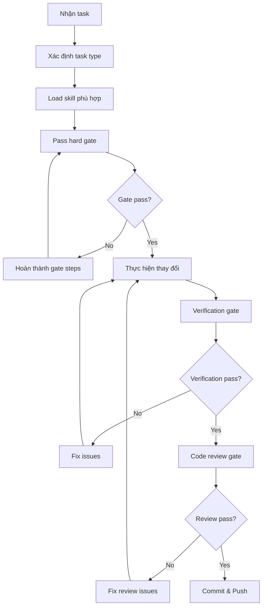

# ShipFood AI Rules

> ⚠️ **BẮT BUỘC**: Mỗi task PHẢI pass hard gate trước khi code. KHÔNG có exception.

---

## 0. 📝 LOG SKILL — BẮT BUỘC MỖI RESPONSE

**Format bắt buộc** — KHÔNG BAO GIỜ response mà KHÔNG có log skill ở đầu:

```
**Skill đã load**: <danh sách skill đã load>
**Skills Repo used**: <repo> | <mục đích>
**Agent spawned**: <agent> | <mục đích> (nếu có)
```

**Ví dụ**:
```
**Skill đã load**: systematic-debugging, ponytail, verification-before-completion
**Skills Repo used**: developer-icons-main | SVG icons for navbar
**Agent spawned**: code-reviewer | Review VoucherManager XSS fix
```

**Rules**:
- Log skill TRƯỚC KHI làm việc, KHÔNG phải sau
- Khi load skill mới → thêm vào danh sách
- Khi dùng repo → ghi rõ repo nào, dùng làm gì
- Khi spawn agent → ghi agent nào, mục đích gì

---

## 1. 🚧 HARD GATES — Không pass = Không làm tiếp

Mỗi task type có gate BẮT BUỘC. Không được skip.

### Gate: Bug Fix

```yaml
bug_fix_gate:
  trigger: "Có bug, test failure, unexpected behavior"
  required_skills: "systematic-debugging"
  steps:
    1_load: "skill systematic-debugging"
    2_read: "Đọc error message CHU ĐƠN — line number, file path, error code"
    3_reproduce: "Tìm steps chính xác để trigger bug"
    4_trace: "Trace root cause — tìm WHERE breaks, không phải WHAT breaks"
    5_hypothesis: "Form hypothesis: 'X là root cause vì Y'"
    6_evidence: "Gather evidence — ghi root cause ra response"
    7_propose: "CHỈ SAU ĐÓ mới propose fix"
  red_flags:
    - "Quick fix for now, investigate later"
    - "Just try changing X"
    - "I think it's X, let me fix that"
  rule: "Đã fix 2 lần mà chưa fix được → STOP, question architecture"
```

### Gate: UI Change

```yaml
ui_change_gate:
  trigger: "Thay đổi giao diện, component, styling"
  required_skills: "ui-ux-pro-max, ponytail"
  steps:
    1_load: "skill ui-ux-pro-max"
    2_search: "python .agents/skills/ui-ux-pro-max/scripts/search.py '<query>' --design-system"
    3_read_output: "Đọc design system output — tokens, colors, typography"
    4_accessibility: "Check Quick Reference §1-3: Accessibility (4.5:1 contrast, 44px touch), Touch, Performance"
    5_annotate: "Ghi design tokens đã chọn vào response"
    6_code: "CHỈ SAU ĐÓ mới code UI"
  deliver_check:
    - "No emojis as icons (dùng SVG)"
    - "All icons from consistent family"
    - "Labels on all form fields"
    - "Error messages near fields"
    - "Loading states for async ops"
```

### Gate: New Feature

```yaml
new_feature_gate:
  trigger: "Thêm tính năng mới"
  required_skills: "brainstorming, writing-plans"
  steps:
    1_load: "skill brainstorming"
    2_context: "Explore project context — files, docs, recent commits"
    3_questions: "Ask clarifying questions — 1 at a time"
    4_approaches: "Propose 2-3 approaches with trade-offs"
    5_design: "Present design → Get user approval"
    6_spec: "Write spec to docs/superpowers/specs/"
    7_review: "User reviews spec"
    8_plan: "skill writing-plans → Tạo implementation plan"
    9_code: "CHỈ SAU ĐÓ mới code"
  hard_gate: "KHÔNG CODE NẾU CHƯA CÓ DESIGN APPROVAL"
```

### Gate: Code Review

```yaml
code_review_gate:
  trigger: "Hoàn thành task, trước merge"
  required_skills: "requesting-code-review"
  steps:
    1_sha: "git rev-parse HEAD~1 và HEAD"
    2_dispatch: "Dispatch general subagent với code-reviewer.md template"
    3_read_review: "Đọc review output"
    4_fix: "Fix Critical ngay, Important trước khi proceed"
    5_claim: "CHỈ SAO ĐÓ mới claim done"
  skip_when: "KHÔNG BAO GIỜ skip vì 'nó đơn giản'"
```

### Gate: Verification

```yaml
verification_gate:
  trigger: "Claim hoàn thành, commit, push"
  required_skills: "verification-before-completion"
  steps:
    1_identify: "Xác định verification command chứng minh claim"
    2_run: "Chạy command (FRESH — không dùng kết quả cũ)"
    3_read: "Đọc output, check exit code, count failures"
    4_verify: "Output confirm claim?"
    5_claim: "CHỈ SAO ĐÓ mới claim"
  never:
    - "Should work now"
    - "Looks correct"
    - "I'm confident"
    - "Tests pass" (nếu chưa chạy test)
```

---

## 2. 🔄 QUY TRÌNH WORKFLOW BẮT BUỘC



### Step-by-step:

1. **Xác định task type** → Bug / UI / Feature / Review
2. **Load skill** → Dùng `skill` tool, KHÔNG tự suy luận
3. **Pass hard gate** → Hoàn thành TẤT CẢ steps trong gate
4. **Thực hiện** → Code với sự hỗ trợ của skill
5. **Verification** → Chạy command, đọc output, confirm
6. **Code Review** → Dispatch subagent, fix issues
7. **Commit** → git add, commit, push

---

## 3. 🧠 CODING RULES (Ponytail)

```yaml
coding_rules:
  default_mode: "ponytail (full)"
  ladder:
    1: "Cần tồn tại không? → YAGNI — bỏ nếu speculative"
    2: "Đã có trong codebase? → Reuse, không viết lại"
    3: "Stdlib làm được? → Dùng stdlib"
    4: "Native feature? → CSS over JS, DB constraint over app code"
    5: "Dependency đã install? → Dùng nó, không thêm mới"
    6: "One line? → One line"
    7: "Minimum code that works"
  mark: "Mọi shortcut → ponytail: comment"
  never_skimp:
    - "Input validation at trust boundaries"
    - "Error handling that prevents data loss"
    - "Security measures"
    - "Accessibility basics"
    - "Things explicitly requested by user"
```

---

## 4. 🐛 DEBUGGING RULES (Systematic Debugging)

```yaml
debugging_rules:
  iron_law: "KHÔNG FIX NẾU CHƯA TÌM ROOT CAUSE"
  four_phases:
    phase_1_root_cause:
      - "Read error message CHU ĐƠN — line number, file path, error code"
      - "Reproduce — tìm steps chính xác để trigger"
      - "Check recent changes — git diff, commit gần nhất"
      - "Gather evidence — log ở mỗi component boundary"
      - "Trace data flow — WHERE breaks, không phải WHAT breaks"
    phase_2_pattern:
      - "Find working examples trong codebase"
      - "Compare against references"
      - "Identify differences — listing every difference"
    phase_3_hypothesis:
      - "Form single hypothesis: 'X là root cause vì Y'"
      - "Test minimally — smallest possible change"
      - "Verify before continuing"
    phase_4_implementation:
      - "Create failing test case"
      - "Implement single fix — ONE change at a time"
      - "Verify fix"
      - "If fix doesn't work: < 3 fixes → return Phase 1; >= 3 → STOP, question architecture"
  red_flags:
    - "Quick fix for now, investigate later"
    - "Just try changing X"
    - "I think it's X, let me fix that"
    - "One more fix attempt" (sau 2+ failures)
```

---

## 5. 🧪 TDD RULES

```yaml
tdd_rules:
  iron_law: "KHÔNG CODE NẾU CHƯA CÓ FAILING TEST"
  cycle:
    red: "Viết test → Chạy → PHẢI thấy FAIL"
    green: "Viết code tối thiểu → Chạy → PHẢI thấy PASS"
    refactor: "Dọn dẹp → Chạy lại → Vẫn PASS"
  verification:
    verify_red: "Chạy test → Confirm fails (not errors) → Fail vì feature missing"
    verify_green: "Chạy test → Confirm passes → Other tests still pass"
  exception: "Chỉ skip TDD khi user đồng ý explicitly"
  delete_rule: "Code trước test? XÓA. Bắt đầu lại từ test."
```

---

## 6. 📝 CODE REVIEW RULES

```yaml
code_review_rules:
  mandatory_after:
    - "Mỗi task trong subagent-driven development"
    - "Hoàn thành major feature"
    - "Trước khi merge"
  process:
    step_1: "git rev-parse HEAD~1 và HEAD"
    step_2: "Dispatch general subagent với code-reviewer.md template"
    step_3: "Đọc review output"
    step_4: "Fix Critical ngay, Important trước khi proceed"
    step_5: "Note Minor cho sau"
  skip_when: "KHÔNG BAO GIỜ skip vì 'nó đơn giản'"
  push_back: "Nếu reviewer sai → push back với technical reasoning"
```

---

## 7. 🔧 Docker Build Rules

### ⚠️ Khi thêm package NuGet mới:

```yaml
nuget_rules:
  - "Luôn kiểm tra version package có tồn tại trên NuGet.org"
  - "Sau dotnet add package → kiểm tra .csproj version CHÍNH XÁC"
  - "Chạy dotnet build LOCAL trước"
  - "Kiểm tra Dockerfile restore được package đó không"
```

### ⚙️ Tối ưu Docker build:

```yaml
docker_optimization:
  - ".dockerignore exclude ShipFoodCore/Skills/ (86MB+ exe)"
  - ".dockerignore exclude .git/, bin/, obj/, node_modules/"
  - "Giữ --no-restore trong publish — restore ở layer riêng"
  - "Thay đổi .csproj → restore layer bị invalidate"
```

### 🔧 Troubleshooting:

```yaml
docker_errors:
  CS0246_PackageNotFound:
    cause: "Package version không tồn tại trên NuGet"
    fix: "Kiểm tra version trong .csproj"
  BuildCham:
    cause: "COPY . . copy cả Skills/ (86MB)"
    fix: "Thêm .dockerignore exclude"
  inotify_crash:
    cause: "Render free tier inotify limit 128"
    fix: "reloadOnChange:false + DOTNET_USE_POLLING_FILE_WATCHER=1"
  appsettings_not_found:
    cause: "Configuration.Sources.Clear() + optional:false"
    fix: "optional:true — fallback env vars"
```

---

## 8. 🖼️ Nguồn Ảnh & Media

```yaml
image_rules:
  allowed_sources:
    - "Pexels Videos: https://www.pexels.com/videos/"
    - "Local images: /Source/images/MonAn/, /Source/Home/img/"
  forbidden:
    - "Unsplash links trực tiếp trong code (403)"
    - "Emoji làm icon cho navigation, buttons, system controls"
    - "Font Awesome cho logo thương hiệu"
  fallback: "onerror=\"this.src='/Source/Home/img/pizza.jpg'\""
  svg_icons:
    - "Dùng SVG thay Font Awesome (tránh AdBlock)"
    - "Copy: cp ShipFoodCore/Skills/developer-icons-main/icons/<icon>.svg wwwroot/Source/icons/"
    - "Inline SVG hoặc .svg'>"
    - "Đổi màu: fill='currentColor' + CSS color"
```

---

## 9. 🌿 Git Branch Management

```yaml
branch_rules:
  branches:
    master: "Production — ổn định, đã deploy"
    feat/redesign-v2: "Feature development — đang phát triển"
  rules:
    - "KHÔNG tạo branch tạm thời (fix/xxx, deploy/*)"
    - "Mọi thay đổi làm trên nhánh hiện tại, commit trực tiếp"
    - "Khi cần thử nghiệm → feat/redesign-v2"
    - "Xóa branch remote không cần thiết ngay sau khi dùng"
    - "Kiểm tra build Docker LOCAL trước khi push nếu thay đổi csproj/Dockerfile"
```

---

## 10. 🧪 E2E Testing Rules

### Lightpanda — Ưu tiên cho test đơn giản:

```yaml
lightpanda:
  overview: "Lightpanda = headless browser nhanh hơn Chrome 9x, RAM thấp hơn 16x"
  prerequisites:
    - "docker compose up -d"
    - "Config: e2e-tests/lightpanda.config.ts"
  use_when:
    - "Login, redirect, sidebar, search, form validation"
    - "Dashboard load, KPI cards, stats display"
    - "Navigation routing, URL changes"
    - "Healthcheck endpoints, API responses"
  no_use_when:
    - "SignalR WebSocket (TC-6.8/6.9/9.8)"
    - "File upload/preview (TC-3.18)"
    - "localStorage/cookie-dependent flows"
    - "QR code rendering, canvas-based tests"
    - "Multi-tab workflows (TC-3.9)"
  command: "npx playwright test --config=lightpanda.config.ts"
```

### E2E Test Strategy:

| Loại test | Browser | Timeout | Khi nào dùng |
|-----------|---------|---------|--------------|
| Smoke / Simple | Lightpanda | 30s | Search, login, sidebar, redirect |
| Advanced | Chromium | 60s | SignalR, file upload, QR, multi-tab |
| Mobile | Chrome Mobile | 60s | Responsive, viewport, touch |

---

## 11. 📦 Kho Repo Skills

### ShipFoodCore/Skills/:

| Repo | Mô tả | Khi nào dùng |
|------|-------|-------------|
| **developer-icons-main** | 700+ SVG tech icons | Tạo icon, logo UI |
| **ponytail-main** | Ponytail optimization suite | Tối ưu code, refactor |
| **gstack-main** | Security router suite | Audit bảo mật, QA |
| **ui-ux-pro-max-skill-main** | UI/UX design (161 rules, 67 styles) | Thiết kế giao diện |
| **awesome-claude-design** | 68 DESIGN.md patterns | Design system nhất quán |
| **UI UX data** | 161 color palettes CSV | Tra cứu màu sắc, font |
| **public-apis-master** | Public APIs collection | Tìm APIs tích hợp |
| **agent-reach-main** | Agent 13+ platforms | Tìm kiếm/tương tác web |
| **FLow/superpowers-main** | Workflow tools | Quản lý workflow |
| **Graph/codegraph-main** | CodeGraph retrieval | Phân tích codebase |
| **prompt/whisper-flow-main** | Prompt engineering | Thiết kế prompt |

### Cách dùng:

```bash
# Skill có trong available skills → dùng skill tool
skill ponytail
skill ui-ux-pro-max
skill gstack

# Developer Icons → dùng trực tiếp từ thư mục
ls ShipFoodCore/Skills/developer-icons-main/icons/ | grep <từ-khóa>
cp ShipFoodCore/Skills/developer-icons-main/icons/<icon>.svg wwwroot/Source/icons/

# UI UX Pro Max → chạy Python search
python .agents/skills/ui-ux-pro-max/scripts/search.py "<query>" --design-system
```

---

## 12. 📋 Tham chiếu

- Thư mục skills: `.agents/skills/`
- Kho repo skills: `ShipFoodCore/Skills/`
- Dockerfile: `Dockerfile`
- Docker ignore: `.dockerignore`
- E2E tests: `e2e-tests/`
- Design system: `design-system/`

---

*File này được AI đọc tự động mỗi khi làm việc. KHÔNG BAO GIỜ bypass hard gates.*
