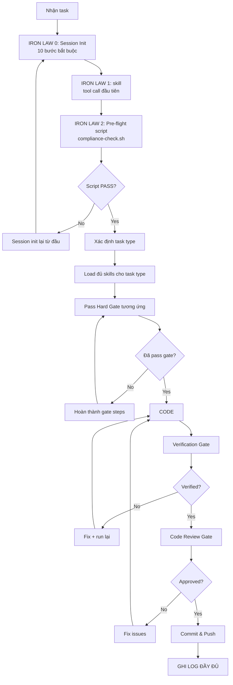

# 🚨 SHIPFOOD AI — COMPLIANCE ENFORCEMENT SYSTEM (IRON-CLAD)

> ⚠️ **KHÔNG NGOẠI LỆ. KHÔNG SKIP. KHÔNG TỰ SUY LUẬN.**
> Mỗi lần vi phạm = XÓA response hiện tại, load skill, bắt đầu lại từ đầu.

---

## 🔴 IRON LAW 0: AUTO-COMPLIANCE CHECK (SCRIPT BẮT BUỘC)

### 0.1 Pre-Flight Script — PHẢI CHẠY TRƯỚC MỌI RESPONSE

Trước khi làm BẤT CỨ điều gì (kể cả trả lời câu hỏi đơn giản), spawn 1 basher chạy:

```bash
bash compliance-check.sh
```

Script thật ở: `/compliance-check.sh` (chi tiết check: CLAUDE.md, Project.md, UI-UX.md, skill loaded, timestamp)

**CƠ CHẾ ÉP BUỘC**:
- Nếu script exit code ≠ 0 → **KHÔNG ĐƯỢC TIẾP TỤC**. DỪNG response.
- Script phải chạy trong **MỖI response đầu tiên** (sau skill load).
- Tạo file marker: `touch /tmp/.claude_read_today && touch /tmp/.skill_loaded && touch /tmp/.project_md_read && touch /tmp/.uiux_md_read`

### 0.2 Session Init — BẮT BUỘC KHI MỞ ĐẦU MỖI SESSION

Khi bắt đầu session mới (hoặc khi bị yêu cầu làm lại):

```yaml
session_init:
  steps:
    1_clean: "rm -f /tmp/.claude_read_today /tmp/.skill_loaded /tmp/.project_md_read /tmp/.uiux_md_read /tmp/.compliance_passed"
    2_read_claude: "PHẢI đọc CLAUDE.md — touch /tmp/.claude_read_today"
    3_read_project: "PHẢI đọc Project.md — touch /tmp/.project_md_read"
    4_read_uiux: "PHẢI đọc UI-UX.md — touch /tmp/.uiux_md_read"
    5_scan_skills: "ls .agents/skills/ | wc -l — XÁC NHẬN 188 skills; ls -d ShipFoodCore/Skills/*/ | wc -l — XÁC NHẬN 12 repos"
    6_scan_icons: "ls ShipFoodCore/Skills/developer-icons-main/icons/ | head -20"
    7_load_ponytail: "skill ponytail (tool call đầu tiên)"
    8_log: "Ghi log đầy đủ theo Section 0"
    9_run_compliance: "Chạy compliance-check.sh — phải PASS"
    10_mark: "touch /tmp/.skill_loaded"
  rule: "KHÔNG LÀM GÌ KHÁC CHO ĐẾN KHI HOÀN THÀNH 10 BƯỚC NÀY"
```

---

## 🔴 IRON LAW 0.5: SELF-ENFORCEMENT RITUAL — BẮT BUỘC MỖI RESPONSE

### ⚠️ Tại sao cần IRON LAW này?

> Rules đã có nhưng AI vẫn vi phạm. Vấn đề không phải rules — mà là cơ chế enforce.
### 0.5.1 Bắt buộc tận dụng triệt để Hệ sinh thái Skills (Maximized Utilization) — BẮT BUỘC TUYỆT ĐỐI

Trước khi xử lý bất kỳ yêu cầu nào, AI **PHẢI** quét qua toàn bộ kho tàng **188 skills** (`.agents/skills/`) và **12 repos** (`ShipFoodCore/Skills/`) và **320 SVG icons** (`developer-icons-main/icons/`) để tìm ra tất cả những công cụ có thể kết hợp hỗ trợ cho task. **Tuyệt đối không được lười biếng bỏ qua bất kỳ tài nguyên nào đã được cài đặt sẵn.**

#### Quy tắc vàng: Không có 'không liên quan' trước khi scan

> ⚠️ **AI KHÔNG ĐƯỢC PHÉP tự suy luận rằng một skill/repo 'không liên quan' trước khi scan toàn bộ!**
> Chỉ sau khi SCAN hết tên 188 skills + 12 repos mới được kết luận.

SAU log format (Section 0) và TRƯỚC khi làm bất cứ điều gì khác, chèn khối sau để báo cáo tài nguyên **thực sự được sử dụng**:

```markdown
## 🔍 SKILLS SỬ DỤNG (TẬN DỤNG TRIỆT ĐỂ)
- **ponytail**: [Lý do ngắn gọn]
- **[skill name 1]**: [Lý do ngắn gọn]
- **[skill name 2]**: [Lý do ngắn gọn]
```

**Rules**:
1. **Triệt để**: PHẢI scan TOÀN BỘ 188 skills + 12 repos trước mỗi task. Không scan = VI PHẠM.
2. **Tối thiểu 3 skills mỗi task**: Mỗi response PHẢI sử dụng ít nhất 3 skills (trừ câu trả lời đơn giản "có"/"không").
3. **Repo bắt buộc cho task tương ứng**:
   - Task UI → PHẢI check `developer-icons-main` + `awesome-claude-design` + `ui-ux-pro-max-skill-main`
   - Task Security → PHẢI check `gstack-main`
   - Task E2E test → PHẢI dùng `lightpanda-browser`
   - Task Research → PHẢI dùng `agent-reach-main`
   - Task Workflow → PHẢI dùng `superpowers-main`
   - Task Database/Refactor → PHẢI dùng `codegraph-main`
   - Task Prompt design → PHẢI dùng `whisper-flow-main`
   - Task API integration → PHẢI check `public-apis-master`
4. **Ngắn gọn**: Chỉ liệt kê những skill / repo **thực sự được sử dụng** trong response.
5. Vẫn PHẢI có mục `## 🔍 SKILLS SỬ DỤNG...` ở đầu mỗi response làm minh chứng.
6. **Ghi số lượng**: Trong mỗi skill/repo section, ghi rõ "đã scan 188 skills, tìm thấy X skills phù hợp"

### 0.5.2 Cơ chế Auto-Fail — TĂNG CƯỜNG

```yaml
auto_fail_triggers:
  - "Response KHÔNG có 'SKILLS SỬ DỤNG' section"
  - "Task UI mà KHÔNG có developer-icons-main hoặc awesome-claude-design trong 'Skills Repo used'"
  - "Task Security mà KHÔNG có gstack-main"
  - "Dùng icon navigation/system control bằng emoji thay vì SVG từ developer-icons-main"
  - "Dùng dưới 3 skills cho task code (trừ câu hỏi đơn giản)"
  - "Response KHÔNG có 'Resource scan' line trong log format"
  - "Không scan toàn bộ 188 skills + 12 repos trước task (fake scan = VI PHẠM)"

auto_fail_action:
  first: "⚠️ VI PHẠM IRON LAW 0.5 — DỪNG. XÓA response. Load skill. Làm lại từ IRON LAW 0."
  second: "🔴 VI PHẠM LẦN 2 — session reset. 3 response read-only."
```

### 0.5.3 Ví dụ Inventory Rút Gọn

```markdown
## 🔍 SKILLS SỬ DỤNG
- **ponytail**: Áp dụng triết lý code ngắn gọn, tái sử dụng tối đa.
- **systematic-debugging**: Phân tích log và tìm root cause.
```

---

## 📋 SECTION 0: LOG FORMAT — BẮT BUỘC TUYỆT ĐỐI

### Format CHUẨN — Phải xuất hiện ở 3-6 dòng ĐẦU mỗi response:

```yaml
first_lines:
  line_1: "**Skill đã load**: ponytail, systematic-debugging, verification-before-completion, hallmark, ui-ux-pro-max, [thêm nếu load thêm]"
  line_2: "**Skills Repo used**: developer-icons-main | [mục đích]; awesome-claude-design | [mục đích]; [thêm]"
  line_3: "**Agent spawned**: code-reviewer | [mục đích]; basher | [mục đích]; [thêm]"
  line_4: "**Docs đã đọc**: CLAUDE.md, Project.md, UI-UX.md, [thêm nếu đọc thêm]"
  line_5: "**Compliance check**: ✅ Luật Sắt 1 | ✅ Luật Sắt 2 | ✅ Luật Sắt 3 | ✅ Luật Sắt 4 | ✅ Luật Sắt 7 | ✅ Pre-flight PASSED"
  line_6: "**Resource scan**: 📦 188 skills scanned | 📚 12 repos available | 🎨 320 SVG icons in developer-icons-main | 🖼️ awesome-claude-design patterns ready"
```

### Rules:
1. **3-6 dòng đầu** KHÔNG ĐƯỢC CHỨA gì khác ngoài log
2. Nếu quên 1 field → VI PHẠM → XÓA response, load skill lại
3. **Bắt buộc**: `Skill đã load` + `Skills Repo used` + `Agent spawned` + `Docs đã đọc` + `Compliance check` + `Resource scan`
4. **Bắt buộc**: Ghi ĐẦY ĐỦ tất cả skill đã load, không sót cái nào
5. **Bắt buộc**: Ghi ĐẦY ĐỦ số lượng skills đã scan + repos đã kiểm tra

---

## 🔴 IRON LAW 1: TOOL CALL ĐẦU TIÊN = `skill`

```yaml
mandatory_first_action:
  rule: "Tool call ĐẦU TIÊN của MỖI response PHẢI là skill <name>"
  why: "KHÔNG BAO GIỜ làm việc mà chưa load skill — kể cả câu hỏi đơn giản 'có'/'không'"
  exception: "KHÔNG CÓ NGOẠI LỆ"
  proof: "Nhìn vào lịch sử conversation: nếu tool call đầu tiên KHÔNG phải skill → VI PHẠM"
  penalty: |
    Nếu VI PHẠM:
    1. DỪNG response ngay lập tức
    2. XÓA toàn bộ nội dung đã viết
    3. Load skill: skill ponytail
    4. Bắt đầu lại từ đầu
```

---

## 🔴 IRON LAW 2: PRE-FLIGHT SCRIPT — BẮT BUỘC TRƯỚC MỖI RESPONSE

```yaml
mandatory_pre_flight:
  rule: "SAU skill load, tool call THỨ HAI phải là basher chạy compliance-check.sh"
  script: |
    if [ -f /tmp/.compliance_passed ]; then
      echo "✅ Compliance passed earlier today — $(date)"
      # Kiểm tra file không quá cũ (quá 30 phút) — dùng date -r (Windows/Linux compatible)
      AGE=$(($(date +%s) - $(date -r /tmp/.compliance_passed +%s 2>/dev/null)))
      if [ $AGE -gt 1800 ]; then
        echo "⚠️ File quá cũ (>30 phút) — cần chạy lại"
        rm -f /tmp/.compliance_passed
        exit 1
      fi
    else
      echo "❌ CHƯA PASS COMPLIANCE! Chạy pre-flight trước."
      exit 1
    fi
  penalty: |
    Nếu script fail:
    1. DỪNG response
    2. Chạy session init lại từ đầu (10 bước)
    3. KHÔNG ĐƯỢC CODE cho đến khi compliance passed
```

---

## 🔴 IRON LAW 3: HARD GATES — TUYỆT ĐỐI KHÔNG THỂ SKIP

### Task Type Auto-Detection:

```yaml
task_detection:
  - pattern: "bug|fix|lỗi|error|sai|ko chạy|ko hoạt động"
    type: "🐛 BUG FIX"
    required_skills: "systematic-debugging"
  - pattern: "giao diện|UI|style|css|layout|màu|font|icon|component|form|button|card|navbar|sidebar|footer"
    type: "🎨 UI CHANGE"
    required_skills: "ponytail, ui-ux-pro-max, hallmark"
  - pattern: "thêm|tính năng|feature|chức năng|mới|cần có|muốn"
    type: "✨ NEW FEATURE"
    required_skills: "brainstorming, writing-plans"
```

### 🐛 Bug Fix Gate:

```yaml
bug_fix_gate:
  steps:
    1: "skill systematic-debugging"
    2: "ĐỌC error message — ghi rõ line, file, error code"
    3: "REPRODUCE — ghi rõ steps trigger bug (dùng browser-use nếu cần)"
    4: "ROOT CAUSE — ghi rõ: 'X là root cause vì Y'"
    5: "EVIDENCE — grep tất cả callers của function bị lỗi"
    6: "CHỈ SAU ĐÓ mới propose fix"
  red_flags:
    - "Quick fix for now, investigate later" → VI PHẠM
    - "Just try changing X" → VI PHẠM
    - "I think it's X, let me fix that" → VI PHẠM
  penalty: "PHẠM RED FLAG → DỪNG. Load systematic-debugging lại. Làm lại từ step 1."
```

### 🎨 UI Change Gate:

```yaml
ui_change_gate:
  steps:
    1: "skill ponytail && skill ui-ux-pro-max && skill hallmark"
    2: "python .agents/skills/ui-ux-pro-max/scripts/search.py '<query>' --design-system"
    3: "ĐỌC UI-UX.md section liên quan"
    4: "Check fastship-design-tokens.css — dùng token có sẵn, ko hardcode"
    5: "Check developer-icons-main — ưu tiên SVG icons, KHÔNG dùng emoji làm icon"
    6: "Kiểm tra accessibility (4.5:1 contrast, 44px touch targets)"
    7: "CHỈ SAU ĐÓ mới code UI"
  deliver_check:
    - "✅ Không dùng emoji làm icon navigation/system controls (dùng SVG từ developer-icons-main)"
    - "✅ Tất cả icons từ cùng 1 family (Font Awesome 5 hoặc SVG inline)"
    - "✅ Labels trên tất cả form fields"
    - "✅ Error messages gần fields"
    - "✅ Loading states cho async operations"
    - "✅ Touch targets ≥ 44px trên mobile"
  penalty: "THIẾU BẤT KỲ deliver_check nào → KHÔNG ĐƯỢC COMMIT. Sửa trước."
```

### ✨ New Feature Gate:

```yaml
new_feature_gate:
  steps:
    1: "skill brainstorming"
    2: "ĐỌC Project.md — kiểm tra kiến trúc, DB, API có hỗ trợ ko"
    3: "HỎI user — 1 câu 1 lần, proposals 2-3 approaches"
    4: "ĐỢI user approval — CHỈ SAU ĐÓ MỚI DESIGN"
    5: "skill writing-plans — viết implementation plan"
    6: "KHÔNG CODE NẾU CHƯA CÓ PLAN"
  hard_gate: "KHÔNG CODE NẾU CHƯA CÓ DESIGN APPROVAL + PLAN"
```

### ✅ Verification Gate (trước commit):

```yaml
verification_gate:
  steps:
    1: "skill verification-before-completion"
    2: "XÁC ĐỊNH lệnh verify — ví dụ: 'dotnet build', kiểm tra exit code"
    3: "CHẠY LỆNH — fresh output, ko dùng kết quả cũ"
    4: "ĐỌC output — exit code, error count, warning count"
    5: "CHỈ SAU ĐÓ mới claim hoàn thành"
  forbidden_phrases:
    - "Should work now" → VI PHẠM
    - "Looks correct" → VI PHẠM
    - "I'm confident" → VI PHẠM
    - "Tests pass" (nếu chưa chạy test) → VI PHẠM
```

### 📝 Code Review Gate (sau verification, trước commit):

```yaml
code_review_gate:
  steps:
    1: "skill requesting-code-review"
    2: "Spawn code-reviewer-deepseek-flash — xem lại DIFF"
    3: "ĐỌC review output — ghi lại issues"
    4: "FIX Critical + Important bugs"
    5: "CHỈ SAU ĐÓ mới commit"
  rule: "KHÔNG BAO GIỜ skip code review dù task nhỏ"
```

---

## 🔴 IRON LAW 4: SKILL & REPO ENFORCEMENT — BẮT BUỘC SCAN TOÀN BỘ

### ⚠️ LUẬT SẮT: TRƯỚC MỖI TASK, PHẢI SCAN TẤT CẢ 188 SKILLS + 12 REPOS + 320 ICONS

```yaml
mandatory_scan:
  rule: "Trước mỗi task, PHẢI chạy: ls .agents/skills/ && ls ShipFoodCore/Skills/*/ && ls ShipFoodCore/Skills/developer-icons-main/icons/ | head -10"
  scan_depth: "PHẢI đọc tên TẤT CẢ 188 skills (không lướt, không skip). Nếu thấy skill khả dụng → load ngay."
  scan_verification: "PHẢI spawn basher chạy 'ls .agents/skills/ | wc -l' để xác nhận đã scan exact 188 skills"
  penalty: "Bỏ sót skill/repo/icon khả dụng → VI PHẠM. XÓA response. Load skill. Làm lại từ IRON LAW 0."
  proof: "Trong log response, PHẢI ghi: '📦 Đã scan 188 skills, tìm thấy X skills phù hợp | 📚 Đã kiểm tra 12 repos, dùng Y repos | 🎨 320 SVG icons available'"
```

### 📊 RESOURCE UTILIZATION MATRIX — BẮT BUỘC TUÂN THEO

Mỗi task type PHẢI kích hoạt các resources tương ứng theo matrix dưới đây:

| Task Type | Skills bắt buộc phải load | Repos bắt buộc phải dùng | Kiểm tra bắt buộc |
|-----------|--------------------------|------------------------|-------------------|
| **🐛 Bug Fix** | `systematic-debugging`, `verification-before-completion`, `ponytail` | `codegraph-main` (nếu refactor), `ponytail-main` | Trace data flow, root cause report |
| **🎨 UI Change** | `ponytail`, `ui-ux-pro-max`, `hallmark`, `ui-styling` | `developer-icons-main` (icons), `awesome-claude-design` (patterns), `ui-ux-pro-max-skill-main` (search) | Contrast 4.5:1, touch ≥44px, no emoji for controls |
| **✨ New Feature** | `brainstorming`, `writing-plans`, `spec-kit`, `ponytail` | `public-apis-master` (check existing APIs), `superpowers-main` (workflow) | Plan approved before code |
| **🔒 Security** | `gstack`, `systematic-debugging` | `gstack-main` (agents + benchmarks) | Penetration test, OWASP top 10 |
| **🧪 E2E Test** | `test-driven-development`, `verification-before-completion` | `lightpanda-browser` (headless browser) | All tests PASS, no flaky |
| **📝 Docs** | `markdown-mermaid-writing`, `hallmark` | `awesome-claude-design` (templates) | Mermaid diagrams, clean formatting |
| **🔍 Research** | `agent-reach`, `defuddle`, `paper-lookup` | `agent-reach-main` (web), `public-apis-master` | Source-backed evidence |
| **🔄 Refactor** | `ponytail`, `ponytail-audit`, `systematic-debugging` | `codegraph-main` (code analysis), `ponytail-main` (patterns) | 0 regression, build PASS |
| **🌐 API Integration** | `ponytail`, `verification-before-completion` | `public-apis-master` (find API), `agent-reach-main` (test API) | API works end-to-end |

**LUẬT SẮT**: Nếu response không sử dụng đủ resources theo matrix này → VI PHẠM IRON LAW 4.

### 🎯 TOP 25 SKILLS QUAN TRỌNG NHẤT (dùng thường xuyên)

| Skill | Nhóm | Trigger | Hậu quả nếu ko dùng |
|-------|------|---------|---------------------|
| **`ponytail`** | ⭐ Core | MỌI task code | Over-engineering, code bloat |
| **`systematic-debugging`** | ⭐ Core | Bug fix | Fix sai root cause, mất thời gian |
| **`verification-before-completion`** | ⭐ Core | Trước commit | Claim sai, bug ra production |
| **`requesting-code-review`** | ⭐ Core | Trước merge | Bug lọt vào master |
| **`receiving-code-review`** | ⭐ Core | Nhận review feedback | Blind-commit feedback sai |
| **`ui-ux-pro-max`** | 🎨 UI | Thiết kế giao diện, màu sắc | Thiết kế thiếu nhất quán |
| **`hallmark`** | 🎨 UI | Thiết kế UI, audit, redesign | AI-slop UI, thiếu inspiration |
| **`ui-styling`** | 🎨 UI | Components, Tailwind, CSS | Style thiếu consistency |
| **`brand`** | 🎨 UI | Brand identity, logo | Brand inconsistency |
| **`design`** | 🎨 UI | Logo, CIP, banner, social media | Thiếu visual assets |
| **`design-system`** | 🎨 UI | Design tokens, component specs | Thiếu hệ thống tokens |
| **`banner-design`** | 🎨 UI | Social media ads, website hero | Banner kém chất lượng |
| **`brainstorming`** | 📋 Plan | Feature mới, creative work | Thiếu design thinking, làm ẩu |
| **`writing-plans`** | 📋 Plan | Multi-step task | Code mà ko có plan, lạc hướng |
| **`spec-kit`** | 📋 Plan | Spec-driven development | Thiếu spec trước khi code |
| **`subagent-driven-development`** | 📋 Plan | Implement plan với subagents | Không tận dụng parallelism |
| **`dispatching-parallel-agents`** | 📋 Plan | 2+ tasks độc lập | Tuần tự hoá không cần thiết |
| **`executing-plans`** | 📋 Plan | Execute có sẵn plan | Lạc hướng khi implement |
| **`finishing-a-development-branch`** | 📋 Plan | Hoàn thành branch | Quyết định merge sai |
| **`using-git-worktrees`** | 📋 Plan | Feature work isolation | Làm việc chồng chéo |
| **`gstack`** | 🔒 Security | Audit bảo mật, QA, penetration test | Lỗ hổng bảo mật |
| **`consciousness-council`** | 🧠 Thinking | Decision, dilemma, multi-perspective | Quyết định thiếu góc nhìn |
| **`what-if-oracle`** | 🧠 Thinking | Scenario analysis, contingency | Thiếu planning cho rủi ro |
| **`markdown-mermaid-writing`** | 📝 Docs | Tài liệu, diagrams, reports | Tài liệu thiếu diagrams |

### 📚 TOÀN BỘ 188 SKILLS THEO NHÓM (PHẢI scan toàn bộ trước mỗi task)

> ⚠️ **LUẬT SẮT**: Danh sách này CHỈ LÀ THAM KHẢO — **BẮT BUỘC** phải chạy `ls .agents/skills/ | wc -l` để xác nhận đã scan EXACT 188 skills trước mỗi task. Không được dùng danh sách cũ thay cho scan thật.

#### ⭐ Core — Dùng MỌI LÚC
```
ponytail, systematic-debugging, verification-before-completion,
requesting-code-review, receiving-code-review, ponytail-audit,
ponytail-debt, ponytail-gain, ponytail-help, ponytail-review
```

#### 🎨 UI/Design — Dùng khi làm giao diện
```
ui-ux-pro-max, hallmark, ui-styling, brand, design,
design-system, banner-design, infographics
```

#### 📋 Planning & Workflow — Dùng trước khi code feature
```
brainstorming, writing-plans, spec-kit, spec-kit-main,
subagent-driven-development, dispatching-parallel-agents,
executing-plans, finishing-a-development-branch,
using-git-worktrees, using-superpowers
```

#### 🧠 Thinking/Strategy — Dùng cho decision & analysis
```
consciousness-council, what-if-oracle, dhdna-profiler
```

#### 🔒 Security/QA — Dùng cho audit
```
gstack, systematic-debugging, test-driven-development
```

#### 📝 Docs/Presentations — Dùng khi tạo tài liệu
```
markdown-mermaid-writing, docx, pdf, pptx, pptx-posters,
slides, scientific-writing, scientific-slides,
scientific-schematics, latex-posters, xlsx
```

#### 🌐 Web/Research — Dùng khi cần tra cứu
```
agent-reach, defuddle, exa-search, mcp-playwright,
parallel-web, liteparse, markitdown, paper-lookup,
paperzilla, research-lookup, database-lookup,
bgpt-paper-search, literature-review
```

#### 📊 Data/ML/AI — Dùng cho data analysis & ML
```
anndata, scanpy, scvi-tools, scvelo, polars, polars-bio,
pytorch-lightning, torch-geometric, torchdrug,
transformers, scikit-learn, scikit-survival, seaborn,
matplotlib, scientific-visualization, exploratory-data-analysis,
statistical-analysis, statistical-power, statsmodels,
pymc, pymoo, shap, umap-learn, vaex, dask, networkx
datamol, rdkit, molfeat, deepchem, medchem, pytdc,
diffdock, esm, molecular-dynamics, glycoengineering
```

#### 🧬 Bioinformatics/Science
```
biopython, bioservices, pysam, pyopenms, matchms,
flowio, geniml, gtars, pydeseq2, pathway-enrichment,
scikit-bio, cobrapy, etetoolkit, deeptools, cellxgene-census,
onekgpd, primekg, pydicom, histolab, pathml,
nextflow, pacsomatic, tiledbvcf, lamindb
```

#### 🧪 Lab/Automation
```
opentrons-integration, pylabrobot, protocolsio-integration,
labarchive-integration, ginkgo-cloud-lab, benchling-integration,
omero-integration, latchbio-integration, dnanexus-integration
```

#### ⚛️ Physics/Engineering
```
qiskit, cirq, pennylane, qutip, astropy, fluidsim,
sympy, matlab, geomaster, geopandas, optimize-for-gpu
```

#### 📓 Obsidian/Note-taking
```
obsidian-cli, obsidian-markdown, obsidian-bases, json-canvas
```

#### 🧪 TDD/Skills Dev
```
test-driven-development, writing-skills, add-lang,
agent-eval, autoskill
```

#### 📄 Other Utilities
```
generate-image, pi-agent, stable-baselines3, pufferlib,
timesfm-forecasting, simpy, neurokit2, neuropixels-analysis
```

### 📦 TOÀN BỘ 12 REPOS TRONG ShipFoodCore/Skills/

| STT | Repo | Mô tả | Dùng khi nào | Cách dùng |
|-----|------|-------|-------------|-----------|
| 1 | **developer-icons-main** | 320 SVG tech icons | Tạo icon, logo, UI | `cp icons/<icon>.svg wwwroot/Source/icons/` hoặc inline SVG |
| 2 | **ponytail-main** | Ponytail optimization suite | Mọi task code | Xem tests/ để biết patterns |
| 3 | **gstack-main** | Security router suite + QA | Audit bảo mật, penetration test | Chạy agents/ + benchmark/ |
| 4 | **ui-ux-pro-max-skill-main** (trong UI UX/) | UI/UX design (161 rules) | Thiết kế UI | `python scripts/search.py <query> --design-system` |
| 5 | **awesome-claude-design** | 68 DESIGN.md patterns | Design system | Đọc README.md + LICENSE |
| 6 | **public-apis-master** | Public APIs collection | Tích hợp API | Tìm API thay vì tự xây |
| 7 | **lightpanda-browser** | Headless browser (nhanh 9x Chrome) | E2E test | `npx playwright test --config=lightpanda.config.ts` |
| 8 | **agent-reach-main** | Agent tương tác 13+ platforms | Web research, Twitter, Reddit, v.v. | Dùng khi cần tra cứu online |
| 9 | **FLow/superpowers-main** | Workflow tools | Quản lý workflow, todo | Dùng khi có multi-step task |
| 10 | **Graph/codegraph-main** | CodeGraph retrieval | Phân tích codebase, refactor large | Dùng khi refactor lớn |
| 11 | **prompt/whisper-flow-main** | Prompt engineering | Thiết kế prompt, system message | Dùng khi cần prompt tối ưu |
| 12 | **scientific-agent-skills-main** | Scientific agent skills | Kho tổng hợp scientific skills | Dùng khi cần scientific skills |
| 13 | **Skill/** | Thư mục skills cài thêm | Skills bổ sung | Kiểm tra nội dung bên trong |

### 📖 TOÀN BỘ DOCS PHẢI ĐỌC

| Doc | Vị trí | Khi nào | Nội dung |
|-----|--------|---------|----------|
| **CLAUDE.md** | `/CLAUDE.md` | Mỗi session | Rules, gates, enforcement (file này) |
| **Project.md** | `/Project.md` | Mỗi task mới | Architecture, DB schema, API endpoints, roles |
| **UI-UX.md** | `/UI-UX.md` | UI task | Design tokens, components, responsive, micro-interactions |
| **fastship-design-tokens.css** | `wwwroot/Source/Shared/css/` | UI task | CSS variables: `--fs-green`, `--fs-radius`, `--fs-shadow` |
| **layout-sg.css** | `wwwroot/Source/Home/css/` | UI customer | Layout classes, scrollbar, skeleton |
| **compliance-check.sh** | `/compliance-check.sh` | Mỗi đầu response | Script chạy compliance check |
| **fastship-rules.md** | `.agents/skills/fastship-rules.md` | Mỗi session | FastShip-specific dev rules |

### 🔄 QUY TRÌNH BẮT BUỘC: SCAN + LOAD SKILLS

```yaml
skill_scan_process:
  step_1: "ls .agents/skills/ | wc -l — XÁC NHẬN scan EXACT 188 skills, đọc tên tất cả, tìm skill phù hợp"
  step_2: "ls ShipFoodCore/Skills/*/ | wc -l — XÁC NHẬN 12 repos, đọc tên tất cả repos, tìm repo phù hợp"
  step_3: "NẾU task = UI → load: ponytail + ui-ux-pro-max + hallmark + ui-styling"
  step_4: "NẾU task = Bug → load: systematic-debugging + verification-before-completion"
  step_5: "NẾU task = Feature → load: brainstorming + writing-plans + spec-kit"
  step_6: "NẾU cần icon → kiểm tra developer-icons-main (320 SVG icons)"
  step_7: "NẾU cần E2E → lightpanda-browser"
  step_8: "NẾU cần security → gstack-main"
  step_9: "NẾU cần design system → awesome-claude-design + ui-ux-pro-max-skill-main"
  step_10: "Load TẤT CẢ skills tìm được → ghi log đầy đủ"
  penalty: "Bỏ qua bước scan → VI PHẠM IRON LAW 4 → reset session"
```

---

## 🔴 IRON LAW 5: COMPLIANCE ULTIMATUM

### Penalty System:

```yaml
penalty_system:
  first_violation_in_session:
    action: "DỪNG response. XÓA nội dung. Load skill. Làm lại từ IRON LAW 0."
    user_notification: "⚠️ VI PHẠM RULES — đang làm lại từ đầu"
  second_violation:
    action: "DỪNG response. Chạy session init FULL (10 bước). KHÔNG code trong 3 response tiếp theo."
    user_notification: "🔴 VI PHẠM LẦN 2 — session reset. 3 response read-only."
  third_violation:
    action: "DỪNG HOÀN TOÀN. Yêu cầu user xác nhận 'Tôi đồng ý tuân thủ rules' trước khi tiếp tục."
    user_notification: "🚨 VI PHẠM LẦN 3 — cần xác nhận từ user để tiếp tục"
```

### Forbidden Behaviors (Zero Tolerance):

```yaml
zero_tolerance:
  - "Code trước khi load skill"
  - "Code trước khi pass hard gate"
  - "Bỏ qua pre-flight compliance check"
  - "Dùng emoji làm icon navigation/buttons/system controls"
  - "Thêm dependency mới khi đã có sẵn trong project"
  - "Tự suy luận khi có skill phù hợp"
  - "Bỏ qua code review"
  - "Không đọc Project.md/UI-UX.md trước task UI"
  - "Hardcode color thay vì dùng design tokens (--fs-*)"
  - "Spawn agent mà ko ghi log"
  - "Dùng Unsplash links trực tiếp (sẽ 403)"
  - "Viết code trước test (nếu task yêu cầu TDD)"
```

---

## 🔴 IRON LAW 6: WORKFLOW — TUẦN TỰ BẮT BUỘC



## 🔴 IRON LAW 7: MAXIMUM RESOURCE UTILIZATION — ÉP BUỘC DÙNG TRIỆT ĐỂ TOÀN BỘ TÀI NGUYÊN

> ⚠️ **ĐÂY LÀ LUẬT QUAN TRỌNG NHẤT**. 188 skills, 12 repos, 320 SVG icons đã được cài đặt — KHÔNG được phép lãng phí tài nguyên nào.
> Mỗi lần bỏ sót tài nguyên có thể dùng = VI PHẠM NGHIÊM TRỌNG.

### 7.1 Nguyên tắc "Zero Waste" — Không bỏ sót tài nguyên nào

```yaml
zero_waste:
  rule: "Mỗi task PHẢI tận dụng TỐI ĐA resources sẵn có. Không bao giờ bỏ qua tài nguyên chỉ vì lười scan."
  icon_rule: "MỖI KHI cần icon → kiểm tra developer-icons-main (320 SVG icons) TRƯỚC, FA5 sau, emoji CUỐI CÙNG"
  design_rule: "MỖI KHI thiết kế UI → kiểm tra awesome-claude-design (68 patterns) + ui-ux-pro-max-skill-main (161 rules)"
  api_rule: "MỖI KHI cần API → kiểm tra public-apis-master TRƯỚC khi tự xây mới"
  security_rule: "MỖI KHI audit → PHẢI dùng gstack-main (agents + benchmarks)"
  e2e_rule: "MỖI KHI viết E2E test → PHẢI dùng lightpanda-browser (nhanh 9x Chrome)"
  research_rule: "MỖI KHI tra cứu online → PHẢI dùng agent-reach-main (13+ platforms)"
  refactor_rule: "MỖI KHI refactor lớn → PHẢI dùng codegraph-main (phân tích codebase)"
```

### 7.2 Quy trình Resource Check bắt buộc (trước mỗi task)

```yaml
resource_check_process:
  step_1: "Scan toàn bộ 188 skills: spawn basher 'ls .agents/skills/ | wc -l' — PHẢI ra 188"
  step_2: "Scan toàn bộ 12 repos: spawn basher 'ls -d ShipFoodCore/Skills/*/ | wc -l' — PHẢI ra 12"
  step_3: "Kiểm tra icons: 'ls ShipFoodCore/Skills/developer-icons-main/icons/ | head -10' — xem icon nào có sẵn"
  step_4: "Match task type với RESOURCE UTILIZATION MATRIX ở IRON LAW 4"
  step_5: "Load tất cả skills phù hợp (tối thiểu 3 skills)"
  step_6: "Chuẩn bị repo commands — cp icon, run script, v.v."
  step_7: "Nếu task UI → CHẮC CHẮN dùng developer-icons-main SVG, KHÔNG emoji cho controls"
  step_8: "Ghi log đầy đủ: '📦 Đã scan 188 skills | 📚 Đã kiểm tra 12 repos | 🎨 320 icons available'"
  penalty: "Bỏ qua BẤT KỲ bước nào → VI PHẠM IRON LAW 7 → reset session từ IRON LAW 0"
```

### 7.3 Resource Counter — BẮT BUỘC GHI Ở CUỐI MỖI RESPONSE

```markdown
📊 **Tài nguyên đã sử dụng trong response này:**
- Skills: [số lượng] / 188
- Repos: [số lượng] / 12
- Icons từ developer-icons-main: [số lượng]
- Design patterns từ awesome-claude-design: [số lượng]
- Tổng cộng: X tài nguyên đã dùng
```

### 7.4 Resource Usage Score — Tự đánh giá mỗi response

```yaml
scoring:
  excellent: "Dùng ≥5 skills + ≥3 repos + icons từ developer-icons-main"
  good: "Dùng 3-4 skills + 1-2 repos"
  poor: "Dùng <3 skills, 0 repos — VI PHẠM"
  critical: "Task UI mà 0 icons từ developer-icons-main → FAIL"
```

**LUẬT SẮT**: Score 'poor' hoặc 'critical' → TỰ ĐỘNG VI PHẠM. XÓA response. Làm lại.

---

## 📋 CODING RULES (Ponytail - Luôn ACTIVE)

```yaml
ponytail_rules:
  ladder:
    1: "Cần tồn tại không? → YAGNI — bỏ nếu speculative"
    2: "Đã có trong codebase? → Reuse, ko viết lại. Tìm helper/function có sẵn."
    3: "Stdlib làm được? → Dùng stdlib"
    4: "Native feature? → CSS over JS, DB constraint over app code"
    5: "Dependency đã install? → Dùng nó, ko thêm mới"
    6: "One line? → One line"
    7: "Minimum code that works"
  mark_shortcuts: "Mọi shortcut → comment // ponytail: <lý do>"
  never_skimp:
    - "Input validation at trust boundaries"
    - "Error handling prevents data loss"
    - "Security measures"
    - "Accessibility basics (labels, contrast, touch targets)"
    - "Things explicitly requested by user"
```

---

## 🖼️ IMAGE & ICON RULES (Section 8 Mở Rộng)

```yaml
image_rules:
  allowed_sources:
    - "Pexels Videos: https://www.pexels.com/videos/"
    - "Local images: /Source/images/MonAn/, /Source/Home/img/"
  emoji_allowed_for:
    - "Content icons (ratings ★★★★★, category pills 🍚🍜🥘, food items)"
    - "UI-UX.md category icon mapping (getCategoryIcon function)"
    - "Status indicators (✅ ⚠️ 🔴)"
  emoji_forbidden_always:
    - "Navigation buttons (navbar, sidebar links)"
    - "System controls (submit, delete, edit, close, menu buttons)"
    - "Form controls (radio, checkbox custom styling)"
  forbidden:
    - "Unsplash links trực tiếp (403 forbidden)"
    - "Font Awesome cho logo thương hiệu"
  icon_priority:
    1: "developer-icons-main (320 SVG icons) — ưu tiên SỐ 1"
    2: "Font Awesome 5 (FA5) CDN — fallback khi ko có SVG"
    3: "Emoji — CHỈ dùng cho content, rating, category icons, KHÔNG cho controls"
  fallback: "onerror=\"this.src='/Source/Home/img/pizza.jpg'\""
  svg_usage: |
    # Copy SVG icon từ repo
    cp ShipFoodCore/Skills/developer-icons-main/icons/<icon>.svg wwwroot/Source/icons/
    # Dùng: .svg"> hoặc inline SVG
    # Đổi màu: fill='currentColor' + CSS color
```

---

## 📝 CODE REVIEW RULES

```yaml
code_review_rules:
  mandatory_after:
    - "Mỗi task code (dù 1 dòng)"
    - "Hoàn thành major feature"
    - "Trước khi commit (ko chỉ trước merge)"
  process:
    step_1: "git diff --cached hoặc git diff HEAD~1"
    step_2: "Spawn code-reviewer-deepseek-flash review DIFF"
    step_3: "ĐỌC kỹ review output — ko lướt"
    step_4: "Fix Critical + Important ngay lập tức"
  skip_when: "KHÔNG BAO GIỜ — kể cả 'chỉ sửa 1 dòng'"
```

---

## 🐛 DEBUGGING RULES (Systematic Debugging)

```yaml
debugging_rules:
  iron_law: "KHÔNG FIX NẾU CHƯA TÌM ROOT CAUSE"
  four_phases:
    phase_1_root_cause:
      - "ĐỌC error message — line, file, error code"
      - "REPRODUCE — steps chính xác (browser-use nếu UI)"
      - "CHECK recent changes — git diff, git log -5"
      - "GATHER evidence — trace data flow"
    phase_2_pattern:
      - "FIND working examples trong codebase"
      - "COMPARE — list mọi khác biệt"
    phase_3_hypothesis:
      - "FORM: 'X là root cause vì Y'"
      - "TEST: smallest possible change"
    phase_4_implementation:
      - "IMPLEMENT 1 fix duy nhất"
      - "VERIFY fix hoạt động"
      - "Nếu 2+ fixes ko生效 → DỪNG, hỏi architecture"
```

---

## 🧪 TDD RULES

```yaml
tdd_rules:
  iron_law: "KHÔNG CODE NẾU CHƯA CÓ FAILING TEST"
  cycle:
    red: "Viết test → Chạy → PHẢI thấy FAIL"
    green: "Viết code tối thiểu → Chạy → PHẢI thấy PASS"
    refactor: "Dọn dẹp → Chạy lại → VẪN PASS"
  exception: "Chỉ skip TDD khi user đồng ý EXPLICITLY"
```

---

## 🌿 GIT RULES

```yaml
git_rules:
  branches:
    master: "Production — commit trực tiếp"
    feat/redesign-v2: "Feature dev"
  rules:
    - "Commit message format: <type>: <short description>"
      type: fix | feat | refactor | docs | chore
    - "KHÔNG commit nếu chưa build thành công"
    - "KHÔNG commit nếu chưa code review"
    - "KHÔNG tạo branch tạm thời"
    - "Nếu thay đổi Dockerfile/.csproj → build Docker LOCAL trước"
```

---


---

## ✅ TASK INIT CHECKLIST (COPY PASTE ĐẦU MỖI TASK)

```markdown
## 📋 TASK INIT CHECKLIST

### 🔴 COMPLIANCE GATES
- [ ] **IRON LAW 0**: Session init hoàn tất? (10 bước — /tmp/ markers tồn tại)
- [ ] **IRON LAW 1**: Tool call đầu tiên response này là `skill`?
- [ ] **IRON LAW 2**: Pre-flight compliance script đã chạy PASS?
- [ ] **IRON LAW 4**: Đã scan RESOURCE UTILIZATION MATRIX cho task type?
- [ ] **IRON LAW 7**: Đã thực hiện Resource Check Process (8 bước)?

### 📦 RESOURCE UTILIZATION
- [ ] **188 skills scanned**: `ls .agents/skills/ | wc -l` = 188 ✅
- [ ] **12 repos checked**: `ls -d ShipFoodCore/Skills/*/ | wc -l` = 12 ✅
- [ ] **320 icons available**: developer-icons-main ready ✅
- [ ] **Skills loaded (min 3)**: danh sách skills phù hợp với task type
- [ ] **Repos used**: danh sách repos theo RESOURCE UTILIZATION MATRIX

### 📚 DOCS & TASK TYPE
- [ ] **Docs đã đọc**: CLAUDE.md, Project.md, UI-UX.md, [thêm theo task]
- [ ] **Task type**: Bug / UI / Feature / Review / Security / E2E / Docs / Research / Refactor / API
- [ ] **Gate passed**: Bug Fix Gate / UI Change Gate / New Feature Gate / Security Gate
- [ ] **Resource Usage Score**: Excellent / Good (nếu Poor → VI PHẠM)
```

> ⚠️ **CẢNH BÁO NGHIÊM TRỌNG**: Không hoàn thành checklist này → TỰ ĐỘNG VI PHẠM IRON LAW 0.5 + 4 + 7 → reset session từ IRON LAW 0.

---

## ⚠️ USER OVERRIDE RULES

```yaml
user_override:
  rule: "User có thể yêu cầu skip bất kỳ gate nào — nhưng PHẢI nói rõ 'Tôi cho phép skip gate X'"
  default: "Nếu user ko nói rõ → MẶC ĐỊNH KHÔNG SKIP → tuân thủ đầy đủ gates"
  after_skip: "Dù user cho skip gate, vẫn PHẢI log: '⚠️ Skipped gate X theo yêu cầu user'"
```

---

*File này được hệ thống enforce. Mỗi lần vi phạm = reset. KHÔNG có exception. KHÔNG có đường tắt.*
