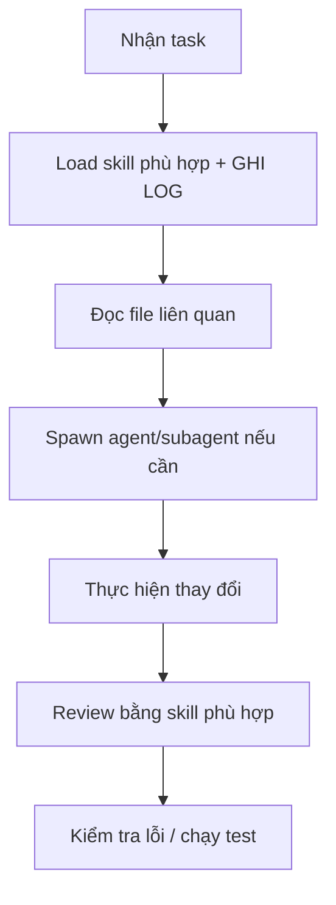

# ShipFood AI Rules

> ⚠️ **BẮT BUỘC**: Luôn sử dụng các skill đã cài đặt trong `.agents/skills/` trước khi thực hiện bất kỳ tác vụ nào.

---

## 0. 📝 LOG SKILL KHI LÀM VIỆC

**BẮT BUỘC**: Mỗi khi bắt đầu hoặc trong quá trình thực hiện task, Buffy PHẢI ghi log các skill đã load:

```yaml
quy_tắc_log_skill:
  - Khi mỗi response bắt đầu, ghi "**Skill đã load**: <danh sách skill>"
  - Khi load skill mới, ghi "**Skill mới load**: <tên skill>"
  - Khi spawn agent, ghi "**Agent spawned**: <tên agent> | mục đích"
```

**Ví dụ**:
```
**Skill đã load**: brainstorming, ui-ux-pro-max, dispatching-parallel-agents
**Agent spawned**: basher | chạy E2E test để verify fix
```

---

## 1. 🎯 Nguyên tắc sử dụng Skills

**TRƯỚC KHI LÀM VIỆC**, phải kiểm tra và sử dụng skill phù hợp từ `.agents/skills/`:

```yaml
quy_tắc_bắt_buộc:
  - Luôn load skill phù hợp với task trước khi bắt đầu
  - Dùng skill thay vì tự suy luận nếu skill đã có sẵn
  - Nếu có nhiều skill liên quan, dùng kết hợp tất cả
  - Ghi log tất cả skill đã load vào mỗi response
```

### 🕐 Tần suất Load Skill

```yaml
tần_suất_load_skill:
  # Mỗi phiên (session) chỉ cần load 1 lần
  - Đầu phiên: load tất cả skill liên quan đến dự án hiện tại
  - Khi chuyển task mới: load skill phù hợp với task đó (nếu chưa load trong phiên)
  - KHÔNG cần reload skill đã load trong cùng phiên
  
  # Khi nào load lại:
  - Bắt đầu session mới (mở lại terminal/IDE)
  - Chuyển sang dự án khác
  - Cần skill mới chưa load trong phiên hiện tại
```

### 📚 Quy trình Load Skill Chuẩn

```yaml
quy_trình_load_skill:
  step_1: "Xác định task cần làm → skill nào phù hợp?"
  step_2: "Kiểm tra skill đã load trong phiên chưa?"
  step_3: |
    Nếu CHƯA load → dùng skill tool để load
    Nếu ĐÃ load → dùng luôn, không load lại
  step_4: "Tham khảo codebase (Project.md, UI-UX.md, file-picker)"
  step_5: "Bắt đầu làm việc với sự hỗ trợ của skill"
```

### Các nhóm skills chính:

| Nhóm | Skill | Khi nào dùng |
|------|-------|-------------|
| **🧠 Lên kế hoạch** | `brainstorming`, `writing-plans`, `executing-plans` | Trước khi code tính năng mới |
| **🔍 Nghiên cứu** | `agent-reach`, `exa-search`, `parallel-web`, `research-lookup` | Cần tìm kiếm thông tin, research API, đọc docs |
| **📐 UI/UX Design** | `ui-ux-pro-max`, `design`, `design-system`, `banner-design`, `brand`, `ui-styling`, `slides` | Thiết kế giao diện, components, styling |
| **🧪 Kiểm thử** | `test-driven-development` | Viết unit test trước khi code |
| **📝 Code Review** | `requesting-code-review`, `receiving-code-review`, `code-reviewer-deepseek-flash` | Review code sau khi thay đổi |
| **🐛 Debug** | `systematic-debugging` | Khi gặp bug, test failure |
| **✂️ Tối ưu code** | `ponytail`, `ponytail-review`, `ponytail-audit` | Giảm thiểu code thừa, tối ưu |
| **🚀 Phát triển** | `subagent-driven-development`, `dispatching-parallel-agents`, `verification-before-completion`, `finishing-a-development-branch` | Chia nhỏ task, chạy parallel agents |
| **🧬 Khoa học/Data** | `scikit-learn`, `matplotlib`, `seaborn`, `statsmodels`, `pandas`... | Phân tích dữ liệu, ML, thống kê |
| **🔬 Bioinformatics** | `scanpy`, `biopython`, `rdkit`, `pydeseq2`... | Nếu dự án có liên quan sinh học/hóa học |
| **🛡 Bảo mật** | `gstack` (security router) | Audit bảo mật |
| **📊 Git/Workflow** | `using-git-worktrees`, `using-superpowers` | Quản lý branch, workflow |
| **📝 Viết skills mới** | `writing-skills` | Khi cần tạo skill tùy chỉnh |

---

## 2. 📋 Quy trình làm việc bắt buộc



1. **Load skill trước**: Dùng `skill tool` để load skill phù hợp
2. **Ghi log**: Ghi rõ skill nào đã load
3. **Đọc tài liệu**: `Project.md`, `UI-UX.md`
4. **Tìm file**: Dùng file-picker, code-searcher
5. **Thực hiện**: Với sự hỗ trợ của skill đã load
6. **Review**: Dùng code-review skill

---

## 3. 🔄 Tham chiếu

- File rules chi tiết: `.agents/skills/fastship-rules.md`
- Danh sách đầy đủ skills: `skills-lock.json`
- Thư mục skills chính: `.agents/skills/`

## 4. 📦 Kho Repo trong thư mục `ShipFoodCore/Skills/`

### Các repo skills chính:

| Repo | Mô tả | Khi nào dùng |
|------|-------|-------------|
| **agent-reach-main** | Agent truy cập 13+ nền tảng | Cần tìm kiếm/tương tác web |
| **ponytail-main** | Ponytail optimization suite | Tối ưu code, giảm thiểu, refactor |
| **codegraph-main** | CodeGraph retrieval & indexing | Phân tích codebase |
| **gstack-main** | Security router suite | Audit bảo mật |
| **superpowers-main** | Superpowers workflow tools | Quản lý workflow |
| **whisper-flow-main** | Prompt engineering | Thiết kế prompt |
| **ui-ux-pro-max** | UI/UX design | Thiết kế giao diện |
| **developer-icons-main** | Bộ icon SVG | Tạo icon, logo |

## 5. 🖼️ Nguồn Ảnh & Tài Nguyên Media

### 📸 Nguồn ảnh được phép sử dụng:

| Nguồn | URL | Loại |
|-------|-----|------|
| **Pexels Videos** | `https://www.pexels.com/videos/` | Video stock miễn phí |
| Unsplash | `https://unsplash.com` | Ảnh stock (đã biết 403 — ưu tiên local) |

**Quy tắc sử dụng ảnh:**
- ❌ KHÔNG dùng link Unsplash trực tiếp trong code (dễ bị 403)
- ✅ Tải ảnh về local: `/Source/images/MonAn/` (món ăn), `/Source/Home/img/` (rest, icons)
- ✅ Fallback khi ảnh lỗi: `onerror="this.src='/Source/Home/img/pizza.jpg'"`
- ✅ Đặt ảnh trong wwwroot để ASP.NET Core serve trực tiếp

## 6. 🌿 Git Branch Management

**Từ nay chỉ giữ 2 branch chính:**

| Branch | Mục đích |
|--------|---------|
| `master` | Production — ổn định, đã deploy |
| `feat/redesign-v2` | Feature development — đang phát triển |

**Quy tắc:**
- ❌ KHÔNG tạo branch tạm thời như `fix/xxx`, `railway/*`, `deploy/*`
- ✅ Mọi thay đổi đều làm trên nhánh hiện tại, commit trực tiếp
- ✅ Khi cần thử nghiệm, dùng `feat/redesign-v2`
- ✅ Xóa branch remote không cần thiết ngay sau khi dùng xong

---

*File này được AI đọc tự động mỗi khi làm việc với dự án. Tuân thủ nghiêm ngặt.*
