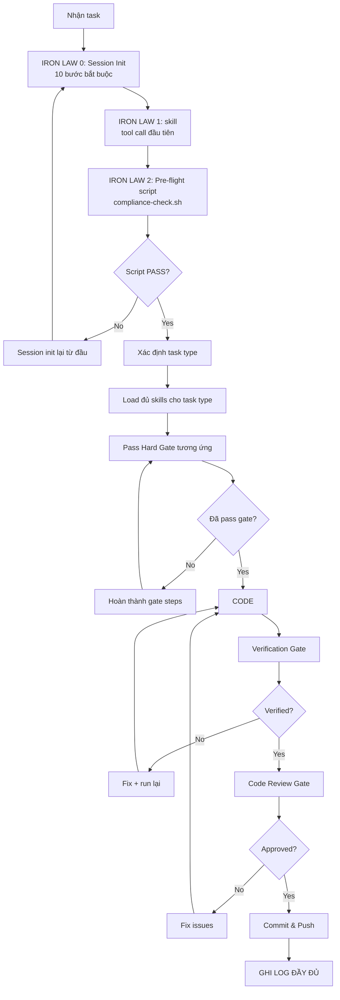

# 🚨 SHIPFOOD AI — COMPLIANCE ENFORCEMENT SYSTEM (IRON-CLAD)

> ⚠️ **KHÔNG NGOẠI LỆ. KHÔNG SKIP. KHÔNG TỰ SUY LUẬN.**
> Mỗi lần vi phạm = XÓA response hiện tại, load skill, bắt đầu lại từ đầu.

---

## 🔴 IRON LAW 0: AUTO-COMPLIANCE CHECK (SCRIPT BẮT BUỘC)

### 0.1 Pre-Flight Script — PHẢI CHẠY TRƯỚC MỌI RESPONSE

Trước khi làm BẤT CỨ điều gì (kể cả trả lời câu hỏi đơn giản), spawn 1 basher chạy script sau:

```bash
# compliance-check.sh — TỰ ĐỘNG KIỂM TRA COMPLIANCE
# Đặt ở thư mục gốc dự án

echo "=== 🚨 COMPLIANCE PRE-FLIGHT CHECK ==="

# 1. Kiểm tra response count trong session — nếu >3 response chưa đọc lại CLAUDE.md → CẢNH BÁO
echo "[1/5] Checking CLAUDE.md read status..."
if [ ! -f /tmp/.claude_read_today ]; then
    echo "❌ CHƯA ĐỌC CLAUDE.md hôm nay!"
    echo "   → PHẢI đọc lại CLAUDE.md trước khi tiếp tục"
    exit 1
fi

# 2. Kiểm tra đã load skill chưa (kiểm tra log file)
echo "[2/5] Checking skill load status..."
if [ ! -f /tmp/.skill_loaded ]; then
    echo "❌ CHƯA LOAD SKILL!"
    echo "   → Tool call đầu tiên phải là skill <name>"
    exit 1
fi

# 3. Kiểm tra docs đã đọc
echo "[3/5] Checking docs..."
if [ ! -f /tmp/.project_md_read ]; then
    echo "❌ CHƯA ĐỌC Project.md!"
    exit 1
fi
if [ ! -f /tmp/.uiux_md_read ]; then
    echo "❌ CHƯA ĐỌC UI-UX.md!"
    exit 1
fi

# 4. Kiểm tra skills scan
echo "[4/5] Checking skills scan..."
SKILL_COUNT=$(ls .agents/skills/ 2>/dev/null | wc -l)
REPO_COUNT=$(ls ShipFoodCore/Skills/*/ 2>/dev/null | wc -l)
echo "   Skills: $SKILL_COUNT | Repos: $REPO_COUNT"

# 5. Ghi timestamp
echo "[5/5] PASSED ✅ — $(date)"
touch /tmp/.compliance_passed
exit 0
```

**CƠ CHẾ ÉP BUỘC**:
- Nếu script exit code ≠ 0 → **KHÔNG ĐƯỢC TIẾP TỤC**. DỪNG response.
- Script phải chạy trong **MỖI response đầu tiên** (sau skill load).
- Tạo file marker: `touch /tmp/.claude_read_today && touch /tmp/.skill_loaded && touch /tmp/.project_md_read && touch /tmp/.uiux_md_read`

### 0.2 Session Init — BẮT BUỘC KHI MỞ ĐẦU MỖI SESSION

Khi bắt đầu session mới (hoặc khi bị yêu cầu làm lại):

```yaml
session_init:
  steps:
    1_clean: "rm -f /tmp/.claude_read_today /tmp/.skill_loaded /tmp/.project_md_read /tmp/.uiux_md_read /tmp/.compliance_passed"
    2_read_claude: "PHẢI đọc CLAUDE.md — touch /tmp/.claude_read_today"
    3_read_project: "PHẢI đọc Project.md — touch /tmp/.project_md_read"
    4_read_uiux: "PHẢI đọc UI-UX.md — touch /tmp/.uiux_md_read"
    5_scan_skills: "ls .agents/skills/ && ls ShipFoodCore/Skills/*/"
    6_scan_icons: "ls ShipFoodCore/Skills/developer-icons-main/icons/ | head -20"
    7_load_ponytail: "skill ponytail (tool call đầu tiên)"
    8_log: "Ghi log đầy đủ theo Section 0"
    9_run_compliance: "Chạy compliance-check.sh — phải PASS"
    10_mark: "touch /tmp/.skill_loaded"
  rule: "KHÔNG LÀM GÌ KHÁC CHO ĐẾN KHI HOÀN THÀNH 10 BƯỚC NÀY"
```

---

## 📋 SECTION 0: LOG FORMAT — BẮT BUỘC TUYỆT ĐỐI

### Format CHUẨN — Phải xuất hiện ở 3 dòng ĐẦU mỗi response:

```yaml
first_3_lines:
  line_1: "**Skill đã load**: ponytail, systematic-debugging, verification-before-completion, hallmark, ui-ux-pro-max, [thêm nếu load thêm]"
  line_2: "**Skills Repo used**: developer-icons-main | [mục đích]; awesome-claude-design | [mục đích]; [thêm]"
  line_3: "**Agent spawned**: code-reviewer | [mục đích]; basher | [mục đích]; [thêm]"
  line_4: "**Docs đã đọc**: CLAUDE.md, Project.md, UI-UX.md, [thêm nếu đọc thêm]"
  line_5: "**Compliance check**: ✅ Luật Sắt 1 | ✅ Luật Sắt 2 | ✅ Luật Sắt 3 | ✅ Pre-flight PASSED"
```

### Rules:
1. **3 dòng đầu** KHÔNG ĐƯỢC CHỨA gì khác ngoài log
2. Nếu quên 1 field → VI PHẠM → XÓA response, load skill lại
3. **Bắt buộc**: `Skill đã load` + `Skills Repo used` + `Agent spawned` + `Docs đã đọc` + `Compliance check`
4. **Bắt buộc**: Ghi ĐẦY ĐỦ tất cả skill đã load, không sót cái nào

---

## 🔴 IRON LAW 1: TOOL CALL ĐẦU TIÊN = `skill`

```yaml
mandatory_first_action:
  rule: "Tool call ĐẦU TIÊN của MỖI response PHẢI là skill <name>"
  why: "KHÔNG BAO GIỜ làm việc mà chưa load skill — kể cả câu hỏi đơn giản 'có'/'không'"
  exception: "KHÔNG CÓ NGOẠI LỆ"
  proof: "Nhìn vào lịch sử conversation: nếu tool call đầu tiên KHÔNG phải skill → VI PHẠM"
  penalty: |
    Nếu VI PHẠM:
    1. DỪNG response ngay lập tức
    2. XÓA toàn bộ nội dung đã viết
    3. Load skill: skill ponytail
    4. Bắt đầu lại từ đầu
```

---

## 🔴 IRON LAW 2: PRE-FLIGHT SCRIPT — BẮT BUỘC TRƯỚC MỖI RESPONSE

```yaml
mandatory_pre_flight:
  rule: "SAU skill load, tool call THỨ HAI phải là basher chạy compliance-check.sh"
  script: |
    if [ -f /tmp/.compliance_passed ]; then
      echo "✅ Compliance passed earlier today — $(date)"
      # Kiểm tra file không quá cũ (quá 30 phút) — dùng date -r (Windows/Linux compatible)
      AGE=$(($(date +%s) - $(date -r /tmp/.compliance_passed +%s 2>/dev/null)))
      if [ $AGE -gt 1800 ]; then
        echo "⚠️ File quá cũ (>30 phút) — cần chạy lại"
        rm -f /tmp/.compliance_passed
        exit 1
      fi
    else
      echo "❌ CHƯA PASS COMPLIANCE! Chạy pre-flight trước."
      exit 1
    fi
  penalty: |
    Nếu script fail:
    1. DỪNG response
    2. Chạy session init lại từ đầu (10 bước)
    3. KHÔNG ĐƯỢC CODE cho đến khi compliance passed
```

---

## 🔴 IRON LAW 3: HARD GATES — TUYỆT ĐỐI KHÔNG THỂ SKIP

### Task Type Auto-Detection:

```yaml
task_detection:
  - pattern: "bug|fix|lỗi|error|sai|ko chạy|ko hoạt động"
    type: "🐛 BUG FIX"
    required_skills: "systematic-debugging"
  - pattern: "giao diện|UI|style|css|layout|màu|font|icon|component|form|button|card|navbar|sidebar|footer"
    type: "🎨 UI CHANGE"
    required_skills: "ponytail, ui-ux-pro-max, hallmark"
  - pattern: "thêm|tính năng|feature|chức năng|mới|cần có|muốn"
    type: "✨ NEW FEATURE"
    required_skills: "brainstorming, writing-plans"
```

### 🐛 Bug Fix Gate:

```yaml
bug_fix_gate:
  steps:
    1: "skill systematic-debugging"
    2: "ĐỌC error message — ghi rõ line, file, error code"
    3: "REPRODUCE — ghi rõ steps trigger bug (dùng browser-use nếu cần)"
    4: "ROOT CAUSE — ghi rõ: 'X là root cause vì Y'"
    5: "EVIDENCE — grep tất cả callers của function bị lỗi"
    6: "CHỈ SAU ĐÓ mới propose fix"
  red_flags:
    - "Quick fix for now, investigate later" → VI PHẠM
    - "Just try changing X" → VI PHẠM
    - "I think it's X, let me fix that" → VI PHẠM
  penalty: "PHẠM RED FLAG → DỪNG. Load systematic-debugging lại. Làm lại từ step 1."
```

### 🎨 UI Change Gate:

```yaml
ui_change_gate:
  steps:
    1: "skill ponytail && skill ui-ux-pro-max && skill hallmark"
    2: "python .agents/skills/ui-ux-pro-max/scripts/search.py '<query>' --design-system"
    3: "ĐỌC UI-UX.md section liên quan"
    4: "Check fastship-design-tokens.css — dùng token có sẵn, ko hardcode"
    5: "Check developer-icons-main — ưu tiên SVG icons, KHÔNG dùng emoji làm icon"
    6: "Kiểm tra accessibility (4.5:1 contrast, 44px touch targets)"
    7: "CHỈ SAU ĐÓ mới code UI"
  deliver_check:
    - "✅ Không dùng emoji làm icon navigation/system controls (dùng SVG từ developer-icons-main)"
    - "✅ Tất cả icons từ cùng 1 family (Font Awesome 5 hoặc SVG inline)"
    - "✅ Labels trên tất cả form fields"
    - "✅ Error messages gần fields"
    - "✅ Loading states cho async operations"
    - "✅ Touch targets ≥ 44px trên mobile"
  penalty: "THIẾU BẤT KỲ deliver_check nào → KHÔNG ĐƯỢC COMMIT. Sửa trước."
```

### ✨ New Feature Gate:

```yaml
new_feature_gate:
  steps:
    1: "skill brainstorming"
    2: "ĐỌC Project.md — kiểm tra kiến trúc, DB, API có hỗ trợ ko"
    3: "HỎI user — 1 câu 1 lần, proposals 2-3 approaches"
    4: "ĐỢI user approval — CHỈ SAU ĐÓ MỚI DESIGN"
    5: "skill writing-plans — viết implementation plan"
    6: "KHÔNG CODE NẾU CHƯA CÓ PLAN"
  hard_gate: "KHÔNG CODE NẾU CHƯA CÓ DESIGN APPROVAL + PLAN"
```

### ✅ Verification Gate (trước commit):

```yaml
verification_gate:
  steps:
    1: "skill verification-before-completion"
    2: "XÁC ĐỊNH lệnh verify — ví dụ: 'dotnet build', kiểm tra exit code"
    3: "CHẠY LỆNH — fresh output, ko dùng kết quả cũ"
    4: "ĐỌC output — exit code, error count, warning count"
    5: "CHỈ SAU ĐÓ mới claim hoàn thành"
  forbidden_phrases:
    - "Should work now" → VI PHẠM
    - "Looks correct" → VI PHẠM
    - "I'm confident" → VI PHẠM
    - "Tests pass" (nếu chưa chạy test) → VI PHẠM
```

### 📝 Code Review Gate (sau verification, trước commit):

```yaml
code_review_gate:
  steps:
    1: "skill requesting-code-review"
    2: "Spawn code-reviewer-deepseek-flash — xem lại DIFF"
    3: "ĐỌC review output — ghi lại issues"
    4: "FIX Critical + Important bugs"
    5: "CHỈ SAU ĐÓ mới commit"
  rule: "KHÔNG BAO GIỜ skip code review dù task nhỏ"
```

---

## 🔴 IRON LAW 4: SKILL & REPO ENFORCEMENT

### Mỗi skill trong dự án — khi nào PHẢI dùng:

| Skill | Trigger | Hậu quả nếu ko dùng |
|-------|---------|---------------------|
| **`ponytail`** | MỌI task code | Over-engineering, code bloat |
| **`systematic-debugging`** | Bug fix | Fix sai root cause, mất thời gian |
| **`ui-ux-pro-max`** | UI change | Thiết kế thiếu nhất quán, màu sắc lệch |
| **`hallmark`** | UI change | AI-slop UI, thiếu inspiration |
| **`brainstorming`** | Feature mới | Thiếu design thinking, làm ẩu |
| **`writing-plans`** | Feature mới | Code mà ko có plan, lạc hướng |
| **`verification-before-completion`** | Trước commit | Claim sai, bug ra production |
| **`requesting-code-review`** | Trước merge | Bug lọt vào master |

### Mỗi repo trong ShipFoodCore/Skills/ — khi nào PHẢI dùng:

| Repo | Trigger | Cách dùng |
|------|---------|-----------|
| **`developer-icons-main`** (320 SVG icons) | Tạo icon, logo, UI icons | `cp ShipFoodCore/Skills/developer-icons-main/icons/<icon>.svg wwwroot/Source/icons/` hoặc inline SVG. Chỉ dùng emoji cho content (rating, category pills, status) — KHÔNG cho navigation/buttons/system controls. |
| **`ponytail-main`** | Refactor, tối ưu code | Áp dụng Ponytail optimization |
| **`gstack-main`** | Security audit, QA | Audit bảo mật, penetration test |
| **`ui-ux-pro-max-skill-main`** | Design UI | `python .agents/skills/ui-ux-pro-max/scripts/search.py <query>` |
| **`awesome-claude-design`** | Design system | 68 DESIGN.md patterns — đọc trước khi design |
| **`public-apis-master`** | Tích hợp API | Tìm public APIs thay vì tự xây |
| **`lightpanda-browser`** | E2E test | Lightpanda headless browser (nhanh hơn Chrome 9x) |
| **`agent-reach-main`** | Web research | Tương tác Twitter, Reddit, web |
| **`FLow/superpowers-main`** | Workflow | Quản lý workflow, todo tracking |

### Mỗi file doc — BẮT BUỘC đọc trước task:

| Doc | Khi nào đọc | Nội dung chính |
|-----|-------------|----------------|
| **CLAUDE.md** | Mỗi session | Rules, gates, enforcement (file này) |
| **Project.md** | Mỗi task mới | Architecture, DB schema, API endpoints, roles |
| **UI-UX.md** | UI task | Design tokens, components, responsive breakpoints, micro-interactions |
| **`fastship-design-tokens.css`** | UI task | CSS variables: `--fs-green`, `--fs-radius`, `--fs-shadow`, etc. |
| **`layout-sg.css`** | UI task (customer) | Layout classes, scrollbar handling, skeleton loading |
| **`compliance-check.sh`** | Mỗi đầu response | Script chạy compliance check — PHẢI chạy sau skill load |

---

## 🔴 IRON LAW 5: COMPLIANCE ULTIMATUM

### Penalty System:

```yaml
penalty_system:
  first_violation_in_session:
    action: "DỪNG response. XÓA nội dung. Load skill. Làm lại từ IRON LAW 0."
    user_notification: "⚠️ VI PHẠM RULES — đang làm lại từ đầu"
  second_violation:
    action: "DỪNG response. Chạy session init FULL (10 bước). KHÔNG code trong 3 response tiếp theo."
    user_notification: "🔴 VI PHẠM LẦN 2 — session reset. 3 response read-only."
  third_violation:
    action: "DỪNG HOÀN TOÀN. Yêu cầu user xác nhận 'Tôi đồng ý tuân thủ rules' trước khi tiếp tục."
    user_notification: "🚨 VI PHẠM LẦN 3 — cần xác nhận từ user để tiếp tục"
```

### Forbidden Behaviors (Zero Tolerance):

```yaml
zero_tolerance:
  - "Code trước khi load skill"
  - "Code trước khi pass hard gate"
  - "Bỏ qua pre-flight compliance check"
  - "Dùng emoji làm icon navigation/buttons/system controls"
  - "Thêm dependency mới khi đã có sẵn trong project"
  - "Tự suy luận khi có skill phù hợp"
  - "Bỏ qua code review"
  - "Không đọc Project.md/UI-UX.md trước task UI"
  - "Hardcode color thay vì dùng design tokens (--fs-*)"
  - "Spawn agent mà ko ghi log"
  - "Dùng Unsplash links trực tiếp (sẽ 403)"
  - "Viết code trước test (nếu task yêu cầu TDD)"
```

---

## 🔴 IRON LAW 6: WORKFLOW — TUẦN TỰ BẮT BUỘC



---

## 📋 CODING RULES (Ponytail - Luôn ACTIVE)

```yaml
ponytail_rules:
  ladder:
    1: "Cần tồn tại không? → YAGNI — bỏ nếu speculative"
    2: "Đã có trong codebase? → Reuse, ko viết lại. Tìm helper/function có sẵn."
    3: "Stdlib làm được? → Dùng stdlib"
    4: "Native feature? → CSS over JS, DB constraint over app code"
    5: "Dependency đã install? → Dùng nó, ko thêm mới"
    6: "One line? → One line"
    7: "Minimum code that works"
  mark_shortcuts: "Mọi shortcut → comment // ponytail: <lý do>"
  never_skimp:
    - "Input validation at trust boundaries"
    - "Error handling prevents data loss"
    - "Security measures"
    - "Accessibility basics (labels, contrast, touch targets)"
    - "Things explicitly requested by user"
```

---

## 🖼️ IMAGE & ICON RULES (Section 8 Mở Rộng)

```yaml
image_rules:
  allowed_sources:
    - "Pexels Videos: https://www.pexels.com/videos/"
    - "Local images: /Source/images/MonAn/, /Source/Home/img/"
  emoji_allowed_for:
    - "Content icons (ratings ★★★★★, category pills 🍚🍜🥘, food items)"
    - "UI-UX.md category icon mapping (getCategoryIcon function)"
    - "Status indicators (✅ ⚠️ 🔴)"
  emoji_forbidden_always:
    - "Navigation buttons (navbar, sidebar links)"
    - "System controls (submit, delete, edit, close, menu buttons)"
    - "Form controls (radio, checkbox custom styling)"
  forbidden:
    - "Unsplash links trực tiếp (403 forbidden)"
    - "Font Awesome cho logo thương hiệu"
  icon_priority:
    1: "developer-icons-main (320 SVG icons) — ưu tiên SỐ 1"
    2: "Font Awesome 5 (FA5) CDN — fallback khi ko có SVG"
    3: "Emoji — CHỈ dùng cho content, rating, category icons, KHÔNG cho controls"
  fallback: "onerror=\"this.src='/Source/Home/img/pizza.jpg'\""
  svg_usage: |
    # Copy SVG icon từ repo
    cp ShipFoodCore/Skills/developer-icons-main/icons/<icon>.svg wwwroot/Source/icons/
    # Dùng: .svg"> hoặc inline SVG
    # Đổi màu: fill='currentColor' + CSS color
```

---

## 📝 CODE REVIEW RULES

```yaml
code_review_rules:
  mandatory_after:
    - "Mỗi task code (dù 1 dòng)"
    - "Hoàn thành major feature"
    - "Trước khi commit (ko chỉ trước merge)"
  process:
    step_1: "git diff --cached hoặc git diff HEAD~1"
    step_2: "Spawn code-reviewer-deepseek-flash review DIFF"
    step_3: "ĐỌC kỹ review output — ko lướt"
    step_4: "Fix Critical + Important ngay lập tức"
  skip_when: "KHÔNG BAO GIỜ — kể cả 'chỉ sửa 1 dòng'"
```

---

## 🐛 DEBUGGING RULES (Systematic Debugging)

```yaml
debugging_rules:
  iron_law: "KHÔNG FIX NẾU CHƯA TÌM ROOT CAUSE"
  four_phases:
    phase_1_root_cause:
      - "ĐỌC error message — line, file, error code"
      - "REPRODUCE — steps chính xác (browser-use nếu UI)"
      - "CHECK recent changes — git diff, git log -5"
      - "GATHER evidence — trace data flow"
    phase_2_pattern:
      - "FIND working examples trong codebase"
      - "COMPARE — list mọi khác biệt"
    phase_3_hypothesis:
      - "FORM: 'X là root cause vì Y'"
      - "TEST: smallest possible change"
    phase_4_implementation:
      - "IMPLEMENT 1 fix duy nhất"
      - "VERIFY fix hoạt động"
      - "Nếu 2+ fixes ko生效 → DỪNG, hỏi architecture"
```

---

## 🧪 TDD RULES

```yaml
tdd_rules:
  iron_law: "KHÔNG CODE NẾU CHƯA CÓ FAILING TEST"
  cycle:
    red: "Viết test → Chạy → PHẢI thấy FAIL"
    green: "Viết code tối thiểu → Chạy → PHẢI thấy PASS"
    refactor: "Dọn dẹp → Chạy lại → VẪN PASS"
  exception: "Chỉ skip TDD khi user đồng ý EXPLICITLY"
```

---

## 🌿 GIT RULES

```yaml
git_rules:
  branches:
    master: "Production — commit trực tiếp"
    feat/redesign-v2: "Feature dev"
  rules:
    - "Commit message format: <type>: <short description>"
      type: fix | feat | refactor | docs | chore
    - "KHÔNG commit nếu chưa build thành công"
    - "KHÔNG commit nếu chưa code review"
    - "KHÔNG tạo branch tạm thời"
    - "Nếu thay đổi Dockerfile/.csproj → build Docker LOCAL trước"
```

---

## 💎 REFERENCE: TOÀN BỘ SKILLS & REPOS

### Skills (.agents/skills/) — PHẢI SCAN KHI CÓ TASK PHÙ HỢP:

```bash
# Liệt kê tất cả skills
ls .agents/skills/

# Skills QUAN TRỌNG NHẤT (dùng thường xuyên):
# ponytail, systematic-debugging, verification-before-completion,
# requesting-code-review, brainstorming, writing-plans,
# ui-ux-pro-max, hallmark, gstack
```

### Repos (ShipFoodCore/Skills/) — PHẢI SCAN KHI CẦN:

```bash
# Liệt kê tất cả repos
ls ShipFoodCore/Skills/*/

# ICONS — 320 SVG icons có sẵn
ls ShipFoodCore/Skills/developer-icons-main/icons/ | head -30
# → Dùng: cp ShipFoodCore/Skills/developer-icons-main/icons/<icon>.svg wwwroot/Source/icons/

# Design system patterns
ls ShipFoodCore/Skills/awesome-claude-design/

# Security audit
ls ShipFoodCore/Skills/gstack-main/
```

### Docs — PHẢI ĐỌC TRƯỚC KHI LÀM:

```bash
# Bắt buộc: đọc Project.md + UI-UX.md mỗi session
# Tham khảo: fastship-design-tokens.css, layout-sg.css
```

---

## ✅ TASK INIT CHECKLIST (COPY PASTE ĐẦU MỖI TASK)

```markdown
## 📋 TASK INIT CHECKLIST

- [ ] **IRON LAW 0**: Session init hoàn tất? (10 bước — /tmp/ markers tồn tại)
- [ ] **IRON LAW 1**: Tool call đầu tiên response này là `skill`?
- [ ] **IRON LAW 2**: Pre-flight compliance script đã chạy PASS?
- [ ] **Skill đã load**: ponytail, systematic-debugging, [thêm theo task type]
- [ ] **Docs đã đọc**: CLAUDE.md, Project.md, UI-UX.md
- [ ] **Skills scanned**: `.agents/skills/` + `ShipFoodCore/Skills/`
- [ ] **Task type**: Bug / UI / Feature / Review / Other
- [ ] **Gate passed**: Bug Fix Gate / UI Change Gate / New Feature Gate
```

---

## ⚠️ USER OVERRIDE RULES

```yaml
user_override:
  rule: "User có thể yêu cầu skip bất kỳ gate nào — nhưng PHẢI nói rõ 'Tôi cho phép skip gate X'"
  default: "Nếu user ko nói rõ → MẶC ĐỊNH KHÔNG SKIP → tuân thủ đầy đủ gates"
  after_skip: "Dù user cho skip gate, vẫn PHẢI log: '⚠️ Skipped gate X theo yêu cầu user'"
```

---

*File này được hệ thống enforce. Mỗi lần vi phạm = reset. KHÔNG có exception. KHÔNG có đường tắt.*
