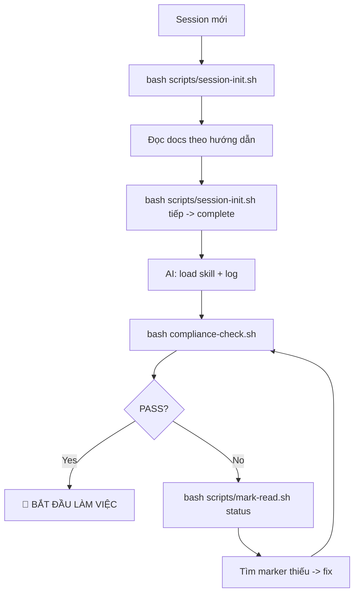

# 🚨 SHIPFOOD AI — Compliance Scripts

## 📋 Tổng quan

Bộ scripts tự động hóa quy trình COMPLIANCE ENFORCEMENT từ `CLAUDE.md`.
Đảm bảo mỗi session AI đều tuân thủ đúng quy trình trước khi code.

## 📂 Các scripts

| File | Chức năng | Dùng khi nào |
|------|-----------|-------------|
| `compliance-check.sh` (root) | Kiểm tra 5 compliance markers | Mỗi đầu response — tool call thứ 2 |
| `scripts/session-init.sh` | Init session 10 bước + chạy compliance | Đầu session mới hoặc khi compliance fail |
| `scripts/mark-read.sh` | Set / xem / xoá markers thủ công | Sau khi đọc docs |

## 🚀 Quick start

### 1. Session mới

```bash
bash scripts/session-init.sh
```

Script sẽ:
1. Xoá markers cũ
2. Hướng dẫn đọc từng doc (nhấn Enter để confirm)
3. Scan skills + repos + icons
4. Set markers
5. Chạy compliance check
6. Báo ready ✅

### 2. Set marker nhanh

```bash
# Sau khi đọc CLAUDE.md
bash scripts/mark-read.sh claude

# Sau khi đọc Project.md
bash scripts/mark-read.sh project

# Sau khi load skill
bash scripts/mark-read.sh skill

# Set tất cả
bash scripts/mark-read.sh all

# Xem trạng thái
bash scripts/mark-read.sh status

# Clean (reset)
bash scripts/mark-read.sh clean
```

### 3. Chạy compliance check

```bash
bash compliance-check.sh
```

## 🔄 Workflow



## 📊 Exit codes (compliance-check.sh)

| Code | Ý nghĩa |
|------|---------|
| 0 | ✅ All checks passed |
| 1 | ❌ CLAUDE.md chưa đọc |
| 2 | ❌ Project.md chưa đọc |
| 3 | ❌ UI-UX.md chưa đọc |
| 4 | ❌ Skill chưa load |
| 5 | ❌ Compliance chưa pass hoặc quá cũ |
